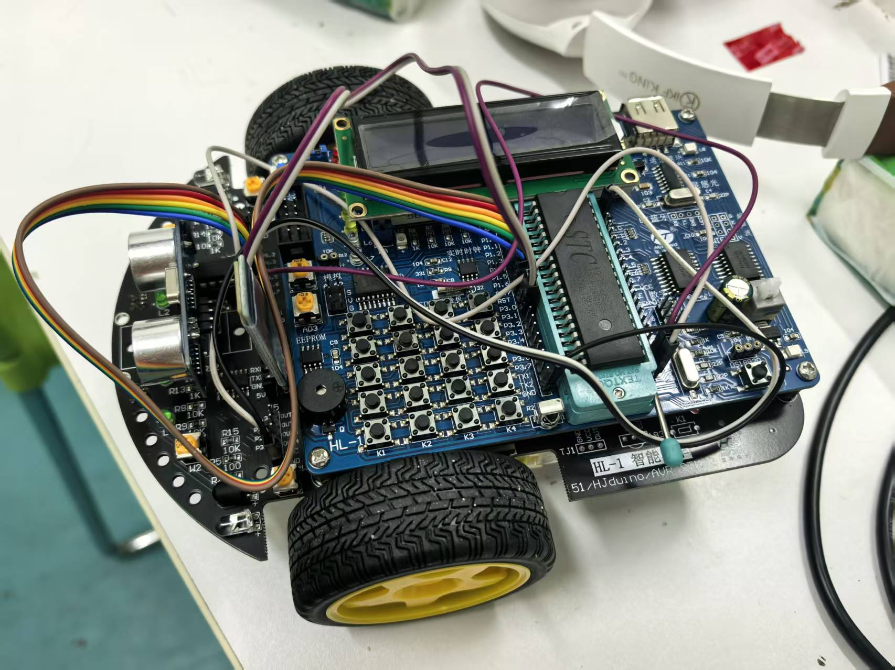
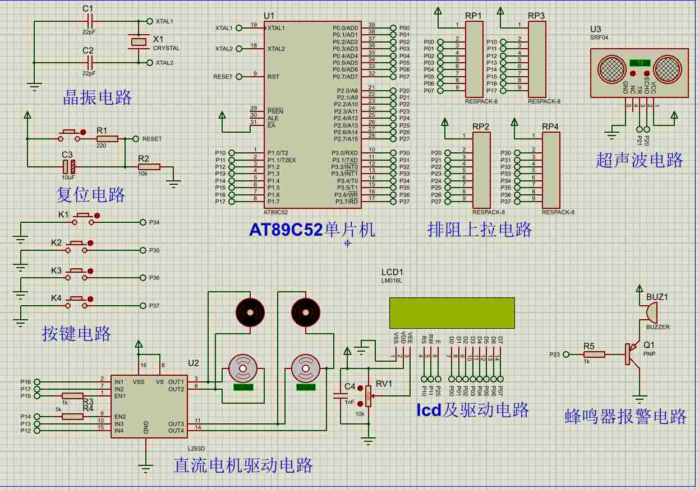

# C51 智能小车

基于 STC89C52RC 单片机的智能小车，具备自动避障、定距跟随和蓝牙遥控功能。

## 硬件平台

本项目基于**慧净电子 HL-1 51 单片机学习板**开发，相关硬件资料及视频教程请自行联系商家获取（淘宝搜索"慧净电子"）。



## 功能

- **自动避障** — 超声波 HC-SR04 检测前方障碍物，自动转向
- **定距跟随** — 保持与前车/目标的固定距离
- **蓝牙控制** — 手机蓝牙遥控小车行驶
- **LCD1602 显示** — 实时显示状态信息

## 硬件模块

| 模块 | 驱动文件 |
|------|----------|
| 蜂鸣器 | `Hardware/beep.c` |
| 蓝牙 | `Hardware/bt.c` |
| 超声波测距 HC-SR04 | `Hardware/hc_sr04.c` |
| 按键 | `Hardware/key.c` |
| LCD1602 液晶显示 | `Hardware/lcd1602.c` |
| 电机驱动 | `Hardware/motor.c` |

## 项目结构

```
├── Hardware/       # 外设驱动
├── SYSTEM/         # 系统代码（延时）
├── User/           # 主程序、中断、显示逻辑
├── 课设仿真/        # Proteus 仿真工程
└── project.uvproj  # Keil MDK 工程文件
```

## 开发环境

- **IDE**: Keil MDK (C51)
- **MCU**: STC89C52RC
- **仿真**: Proteus
- **语言**: C

## 仿真

在 `课设仿真/poteusProject/` 下打开 `project.pdsprj` 即可运行 Proteus 仿真。


