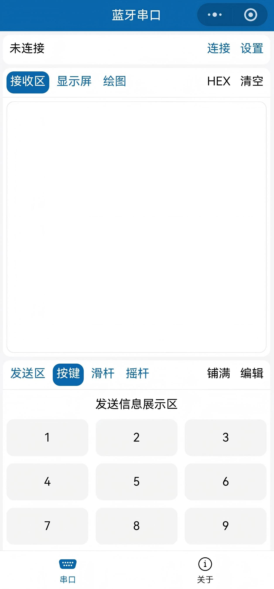

# C51 智能小车

基于 STC89C52RC 单片机的智能小车，具备自动避障、定距跟随和蓝牙遥控功能。


## 硬件平台

本项目基于**慧净电子 HL-1 智能小车底盘**及 **HL-1 51 单片机学习板**开发，相关硬件资料及视频教程请自行联系商家获取（淘宝搜索"慧净电子"，或访问 [慧净电子淘宝店](https://s.taobao.com/search?q=%E6%85%A7%E5%87%80%E7%94%B5%E5%AD%90)）。


### 主要器件

| 模块 | 型号 | 说明 |
|------|------|------|
| 主控 | STC89C52RC | 8K Flash / 512B RAM / 3 定时器 |
| 超声波 | HC-SR04 | 2~400cm，精度 ±3mm |
| 电机驱动 | L298N | 双 H 桥，100 级 PWM 调速 |
| 液晶显示 | LCD1602 | 16×2 字符液晶，HD44780 兼容 |
| 蓝牙 | HC-06 | UART 从机，9600bps |
| 按键 | 4 个独立按键 | K1~K4，上拉电阻方案 |

## 项目结构

```
├── SYSTEM/         # 系统层 — 基础类型、引脚映射、延时、中断宏
│   ├── sys.h / sys.c
│   └── delay.h / delay.c
├── Hardware/       # 驱动层 — 外设初始化、数据收发、状态维护
│   ├── hc_sr04.c   # 超声波测距（滑动窗口均值滤波）
│   ├── motor.c     # L298N 电机驱动（100级 PWM）
│   ├── lcd1602.c   # LCD1602（含 lcdprintf 格式化输出）
│   ├── bt.c        # HC-06 蓝牙（环形缓冲 + 帧解析）
│   ├── key.c       # 按键（非阻塞扫描 + 边沿检测 + 20ms 消抖）
│   └── beep.c      # 蜂鸣器
├── User/           # 应用层 — 主循环调度、模式切换、业务逻辑
│   ├── main.c      # 主循环 + 四种模式业务
│   ├── config.h    # 模块开关 + 可调参数集中管理
│   └── interrupt.c # 中断服务函数集中管理
├── 课设仿真/        # Proteus 9 仿真工程
└── project.uvproj  # Keil C51 工程文件
```

代码遵循**三层分层架构**：系统层（`SYSTEM/`）→ 驱动层（`Hardware/`）→ 应用层（`User/`），模块间低耦合。`config.h` 通过宏开关集中控制所有外设启停，关闭不用的模块可直接释放定时器和存储空间。

## 引脚分配

| 端口 | 引脚 | 功能 |
|------|------|------|
| P0.0~P0.7 | 8 位 | LCD1602 数据总线 |
| P1.0 | RS | LCD1602 寄存器选择 |
| P1.1 | RW | LCD1602 读写控制 |
| P1.2~P1.3 | IN1, IN2 | 右电机方向控制 (L298N) |
| P1.4 | EN1 | 右电机 PWM 使能 (L298N) |
| P1.5 | EN2 | 左电机 PWM 使能 (L298N) |
| P1.6~P1.7 | IN3, IN4 | 左电机方向控制 (L298N) |
| P2.0 | ECHO | HC-SR04 回波输入 |
| P2.1 | TRIG | HC-SR04 触发输出 |
| P2.3 | BEEP | 有源蜂鸣器 |
| P2.5 | EN | LCD1602 使能 |
| P3.0 | RXD | HC-06 蓝牙接收 |
| P3.1 | TXD | HC-06 蓝牙发送 |
| P3.4~P3.7 | K1~K4 | 独立按键 |

## 定时器分配

| 定时器 | 用途 | 模式 | 关键参数 |
|--------|------|------|----------|
| Timer0 | 超声波脉宽测量 | 模式1（16位） | 溢出中断做超时保护 |
| Timer1 | UART 波特率发生器 | 模式2（8位自动重装） | TH1=0xFD，9600bps @11.0592MHz |
| Timer2 | 电机 PWM | 16位自动重装 | 200μs 溢出，100 级分频（等效 50Hz） |

## 开发环境

- **IDE**: Keil C51
- **MCU**: STC89C52RC，晶振 11.0592 MHz
- **仿真**: Proteus 9
- **烧录**: STC-ISP（USB 转 TTL）
- **语言**: C

## 功能

- **自动避障 (AVD)** — 超声波检测障碍物 → 倒车 → 右转 → 前进，有限状态机决策
- **定距跟随 (DIST)** — 比例控制算法自动维持 20cm 跟随距离，死区 ±1cm
- **蓝牙遥控 (BT)** — 手机蓝牙点动控制，松开即停
- **手动调速 (CHECK)** — 按键调速，LCD 实时显示距离和速度

## 使用说明

上电后进入**主菜单**，LCD 显示 `WHICH MODE`，通过 4 个按键选择模式：

| 按键 | 模式 | 说明 |
|------|------|------|
| **K1** | CHECK 手动调速 | K1 加速 / K2 减速（范围 -100~100），LCD 实时显示距离和速度 |
| **K2** | AVD 自动避障 | 遇障 → 倒车(200ms) → 右转(150ms) → 前进；K1/K2 调节避障距离（10~40cm，步进 5cm） |
| **K3** | DIST 定距跟随 | 自动维持 20cm 距离；偏差 ≥6cm 快速(40%)，<6cm 慢速(20%)，±1cm 死区停车 |
| **K4** | 蓝牙遥控 | 进入蓝牙模式，手机发送指令控制 |

> 在 CHECK / AVD / DIST 模式下按 **K4** 返回主菜单。

## 蓝牙上位机

本项目使用 **江协科技** 开发的微信小程序作为蓝牙上位机。

- **Bilibili**: [江协科技](https://space.bilibili.com/383400717)
- **官网**: https://jiangxiekeji.com
- **获取方式**: 微信搜索小程序"蓝牙串口-江协科技"



### 通信协议

小程序按键采用文本帧格式：

| 方向 | 示例 | 含义 |
|------|------|------|
| 上位机 → 下位机 | `[key,4,down]` | 按键 4 按下 |
| 上位机 → 下位机 | `[key,4,up]` | 按键 4 松开 |

- **波特率**: 9600 bps
- **蓝牙模块**: HC-06（从机模式）
- **连接**: MCU P3.0(RXD) / P3.1(TXD) → HC-06 UART

```
STC89C52RC  <--UART 9600-->  HC-06  <--无线-->  微信小程序
```

### 键位映射

| 键 | 动作 | 功能 |
|----|------|------|
| `1` | 按下 | 切到 CHECK 模式 |
| `2` | 按下 | 切到 AVD 模式 |
| `3` | 按下 | 切到 DIST 模式 |
| `4` | 按下/松开 | 前进（点动） |
| `5` | 按下 | 停车 / 返回菜单 |
| `7` | 按下/松开 | 后退（点动） |
| `8` | 按下/松开 | 原地左转（点动） |
| `9` | 按下/松开 | 原地右转（点动） |

### 快速开始

1. 下位机烧录本工程代码
2. 打开微信小程序"蓝牙串口-江协科技"
3. 搜索蓝牙设备，连接 HC-06 模块
4. 进入按键控制界面，发送指令测试

## 性能指标

| 指标 | 数值 |
|------|------|
| 超声波测距精度 | ≤ ±1.5cm |
| 测量范围 | 2 ~ 400cm |
| AVD 避障响应延迟 | ≈ 100ms |
| DIST 巡航稳态误差 | ≤ ±1cm |
| 蓝牙指令响应延迟 | ≤ 20ms |
| 主循环周期 | 10ms |

## 已知局限

- **镜面反射失效**: 障碍物表面倾斜角度过大时超声波回波无法返回，测距值为 0，此时 AVD 状态机会进入 ERROR 停车等待
- **机械跑偏**: 左右电机存在个体差异，代码中对右轮做了固定偏置补偿（AVD +5%，DIST +4%），换用不同电机时可能需要重新标定
- **无温度补偿**: 声速受温度影响（约 0.6m/s/℃），极端温差下测距存在约 2% 附加误差

## 仿真

在 `课设仿真/poteusProject/` 下打开 `project.pdsprj` 即可运行 Proteus 仿真。

> 仿真电路以 AT89C52（兼容 STC89C52）为中心，外接 L293D（替代 L298N）、HC-SR04 超声波模型、LM016L LCD、COMPIM 串口组件等。


